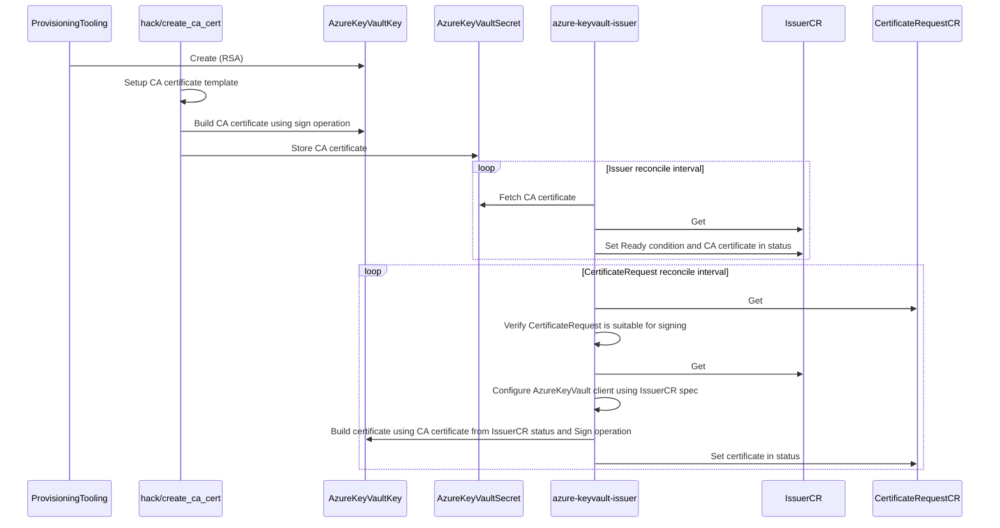

# azure-keyvault-issuer

`azure-keyvault-issuer` is a [external issuer](https://cert-manager.io/docs/configuration/external/) for cert-manager, using an Azure Keyvault "Key" to sign `CertificateRequests`.

## Workflow

Participants:

- `hack/create_ca_cert`: Go command line tool in `hack/create_ca_cert`
- `ProvisioningTooling`: Tooling like `az` or `terraform`
- `azure-keyvault-issuer`: Kubernetes Controller
- `IssuerCR`: Custom Resource (instance, not definition) of azure-keyvault-issuer `Issuer`
- `CertificateRequestCR`: Custom Resource (instance, not definition) of cert-manager `CertificateRequest`

