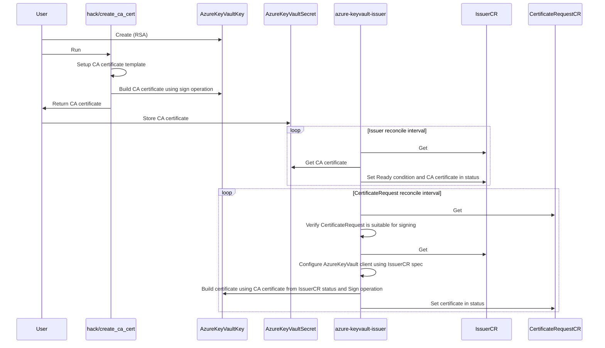

# azure-keyvault-issuer

`azure-keyvault-issuer` is an [external issuer](https://cert-manager.io/docs/configuration/external/) for cert-manager, using an Azure Keyvault "Key" to sign `CertificateRequests`.

## Getting started

1. Create Azure KeyVault
2. Create "Key" inside of Azure Keyvault (only RSA supported for now)
3. Run `hack/create_ca_cert`, push resulting CA certificate into Azure Keyvault "Secret" (with the same name as the name of the "Key")
4. Create user assigned identity for `azure-keyvault-issuer` controller, granting Key/Get, Key/Sign and Secret/Get permissions on the Keyvault
5. Install azure-keyvault-issuer using the kustomize base in `config/default`, configuring workload identity with user assigned identity mentioned above

## Full workflow

Participants:

- `hack/create_ca_cert`: Go command line tool in `hack/create_ca_cert`
- `User`: Human operator using tooling like `az` or `terraform`
- `azure-keyvault-issuer`: Kubernetes controller / cert-manager external issuer controller
- `IssuerCR`: Custom Resource (instance, not definition) of azure-keyvault-issuer `Issuer`
- `CertificateRequestCR`: Custom Resource (instance, not definition) of cert-manager `CertificateRequest`

## Azure Authentication

Authentication works usually by configuring a [workload identity](https://azure.github.io/azure-workload-identity/docs/) for the controller pod.
