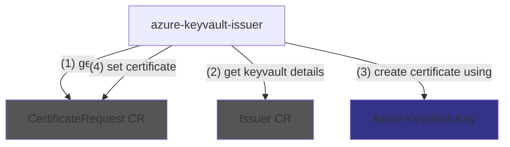
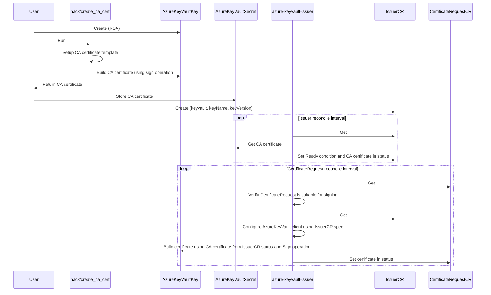

# azure-keyvault-issuer

`azure-keyvault-issuer` is an
[external issuer](https://cert-manager.io/docs/configuration/external/) for
[cert-manager](https://cert-manager.io), using an
[Azure Keyvault "Key"](https://learn.microsoft.com/en-us/azure/key-vault/keys/about-keys)
to sign `CertificateRequests`.

This allows setting up internal PKI's using cert-manager without having access to CA key material, hence minimizing risk of leakage.

`azure-keyvault-issuer` is not affiliated with Microsoft.

`azure-keyvault-issuer` is currently not actively maintained.

## Architectural high level overview



## Tradeoffs / Design decisions

### Management of CA and CA certificate

`azure-keyvault-issuer` does not implement creation of Azure Keyvault Keys and also does not implement creation of a CA certificate.
Instead, users have to (1) create the "Key" manually, (2) can utilize `hack/create_ca_cert` to create a CA certificate using that "Key" and (3) should upload this certificate as Azure Keyvault Secret, so `azure-keyvault-issuer` can download it from there.

This is intended to make multi-cluster setups easy. If the CA certificate was managed (and not just consumed) in an `Issuer` resource inside of Kubernetes, distributing it would be more complicated in some/most cases.

### Azure Authentication

Authentication works usually by configuring a [workload identity](https://azure.github.io/azure-workload-identity/docs/) for the controller pod.

### Algorithms

Only support for RS512 signing is implemented.

## Getting started

The following instructions apply to **AKS clusters with workload identity enabled**. Learn more about Workload identities in the [Azure Docs](https://learn.microsoft.com/en-us/azure/aks/workload-identity-deploy-cluster). Other clusters may need to use different authentication mechanisms.

1. Create Azure KeyVault, assign `Key Vault Administrator` role to yourself
1. Create "Key" inside of Azure Keyvault (only RSA supported for now)
1. Run `go run ./hack/create_ca_cert` (consult `--help` for parameter names, make sure to be logged in with Azure CLI) and push resulting CA certificate into Azure Keyvault "Secret" with the same name as the name of the "Key" (e. g. using `az keyvault secret set ...`)
    ```
    go run ./hack/create_ca_cert --vault.base-url=https://<vaultname>.vault.azure.net/ --vault.key.name=<keyname> --vault.key.version=<keyversion> > ca.crt
    az keyvault secret set --vault-name <vaultname> --name <keyname> --file ca.crt
    ```
1. Create user assigned identity for `azure-keyvault-issuer` controller, granting Key/Get, Key/Sign and Secret/Get permissions on the Keyvault (e. g. using `Key Vault Crypto User` and `Key Vault Secrets User` role assignments)
1. Add to the metadata of the service account in `./config/rbac/service_account.yaml`:
    ```yaml
      annotations:
        azure.workload.identity/client-id: '<client id of your user assigned identity>'
    ```
1. Add `azure.workload.identity/use: "true"` to Pod template metadata labels in `./config/manager/manager.yaml`:
    ```yaml
    ...
    apiVersion: apps/v1
    kind: Deployment
    metadata:
      name: controller-manager
      namespace: system
      ...
    spec:
      selector:
        matchLabels:
          control-plane: controller-manager
      replicas: 1
      template:
        metadata:
          annotations:
            kubectl.kubernetes.io/default-container: manager
          labels:
            azure.workload.identity/use: "true"
            control-plane: controller-manager
    ...
    ```
1. Set up federated identity credential for the service account (`system:serviceaccount:azure-keyvault-issuer-system:azure-keyvault-issuer-controller-manager`) at the user assigned identity
1. Install cert-manager
1. Do
    ```
    kubectl apply -k config/default
    ```
1. Create Issuer
    ```yaml
    apiVersion: azure-keyvault-issuer.gonicus.de/v1alpha1
    kind: Issuer
    metadata:
      name: test-issuer
    spec:
      keyVaultBaseURL: 'https://<insert key vault name>.vault.azure.net/'
      keyName: '<insert key name>'
      keyVersion: '<insert key version>'
    ```
1. Validate health of Issuer
    ```
    kubectl get issuer.azure-keyvault-issuer.gonicus.de test-issuer -oyaml
    ```
1. Use issuer
    ```yaml
    apiVersion: cert-manager.io/v1
    kind: CertificateRequest
    metadata:
      name: test-csr
    spec:
      issuerRef:
        kind: Issuer
        group: azure-keyvault-issuer.gonicus.de
        name: test-issuer
      request: ...
    ```

## Full workflow

Participants:

- `hack/create_ca_cert`: Go command line tool in `hack/create_ca_cert`
- `User`: Human operator using tooling like `az` or `terraform`
- `azure-keyvault-issuer`: Kubernetes controller / cert-manager external issuer controller
- `IssuerCR`: Custom Resource (instance, not definition) of azure-keyvault-issuer `Issuer`
- `CertificateRequestCR`: Custom Resource (instance, not definition) of cert-manager `CertificateRequest`



## Attribution

This issuer was built using the instructions in the [cert-manager `sample-external-issuer`](https://github.com/cert-manager/sample-external-issuer) repo and contains much code from there.
