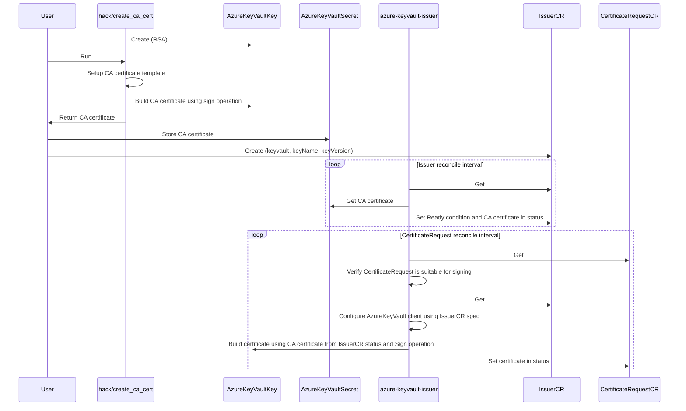

# azure-keyvault-issuer

`azure-keyvault-issuer` is an
[external issuer](https://cert-manager.io/docs/configuration/external/) for
[cert-manager](https://cert-manager.io), using an
[Azure Keyvault "Key"](https://learn.microsoft.com/en-us/azure/key-vault/keys/about-keys)
to sign `CertificateRequests`.

`azure-keyvault-issuer` is not affiliated with Microsoft.

## Tradeoffs / Design decisions

### Management of CA and CA certificate

`azure-keyvault-issuer` does not implement creation of Azure Keyvault Keys and also does not implement creation of a CA certificate.
Instead, users have to (1) create the "Key" manually, (2) can utilize `hack/create_ca_cert` to create a CA certificate using that "Key" and (3) should upload this certificate as Azure Keyvault Secret, so `azure-keyvault-issuer` can download it from there.

This is intended to make multi-cluster setups easy. If the CA certificate was managed (and not just consumed) in an `Issuer` resource inside of Kubernetes, distributing it would be more complicated in some/most cases.

### Azure Authentication

Authentication works usually by configuring a [workload identity](https://azure.github.io/azure-workload-identity/docs/) for the controller pod.

## Attribution

This issuer was built using the instructions in the [cert-manager `sample-external-issuer`](https://github.com/cert-manager/sample-external-issuer) repo and contains much code from there.

## Full workflow

Participants:

- `hack/create_ca_cert`: Go command line tool in `hack/create_ca_cert`
- `User`: Human operator using tooling like `az` or `terraform`
- `azure-keyvault-issuer`: Kubernetes controller / cert-manager external issuer controller
- `IssuerCR`: Custom Resource (instance, not definition) of azure-keyvault-issuer `Issuer`
- `CertificateRequestCR`: Custom Resource (instance, not definition) of cert-manager `CertificateRequest`



## Getting started

1. Create Azure KeyVault
2. Create "Key" inside of Azure Keyvault (only RSA supported for now)
3. Run `hack/create_ca_cert`, push resulting CA certificate into Azure Keyvault "Secret" (with the same name as the name of the "Key")
4. Create user assigned identity for `azure-keyvault-issuer` controller, granting Key/Get, Key/Sign and Secret/Get permissions on the Keyvault
5. Install azure-keyvault-issuer using the kustomize base in `config/default`, configuring workload identity with user assigned identity mentioned above
6. Create Issuer/ClusterIssuer
    ```yaml
    apiVersion: azure-keyvault-issuer.gonicus.de/v1alpha1
    kind: ClusterIssuer
    metadata:
      name: test-clusterissuer
    spec:
      keyVaultBaseURL: 'https://my-cert-manager-vault.vault.azure.net/'
      keyName: test-key
      keyVersion: '<insert key version>'
    ```
7. Validate health of Issuer/ClusterIssuer
    ```
    kubectl get clusterissuer.azure-keyvault-issuer.gonicus.de test-clusterissuer -oyaml
    ```
8. Use issuer
    ```yaml
    apiVersion: cert-manager.io/v1
    kind: CertificateRequest
    metadata:
      name: test-csr
    spec:
      issuerRef:
        kind: ClusterIssuer
        group: azure-keyvault-issuer.gonicus.de
        name: test-clusterissuer
      request: ...
    ```

## Security

For security vulnerabilities, please contact TBD.
